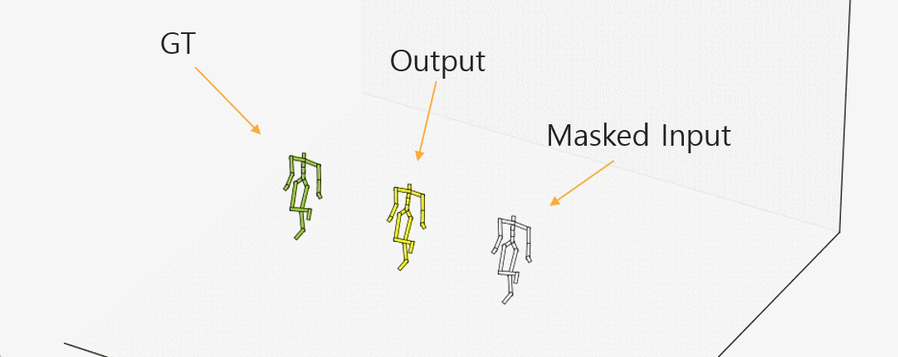

# Human Motion Infilling(Pytorch)

#### Batch normalization is added for stable training.

-----------------

## Result:
<p float="center">
  

</p>


----------
# Usage:

## Data

1. Get data from [Holden et al](https://theorangeduck.com/page/deep-learning-framework-character-motion-synthesis-and-editing)
2. Pre-pocessing by using code from [Kaufmann et al](https://github.com/eth-ait/motion-infilling/tree/be814cfe971ec58d0e66c7644db3cdc89f71d092)


## Run on the code:

### Training

```
python train.py --name <name_of_experiment> --datasetPath <your_train_data_path> --ValdatasetPath <your_valid/test_data_path> 
```

The results will save in ```<Code_path>/experiments(default)/```

You can check the default setting and use it from line 25 to 34 ```<Code_path>/train.py```

### Visualization

The visualization codes are referd from [Here](https://github.com/eth-ait/motion-infilling/tree/be814cfe971ec58d0e66c7644db3cdc89f71d092)

```
cd <Code_path>/VisualizationCode ; python view.py --name <name_of_experiment> --epoch <num of epoch(train)>
```

# Reference
Reference [Paper](https://arxiv.org/abs/2010.11531)(3DV 2020)

Official [Github](https://github.com/eth-ait/motion-infilling/tree/be814cfe971ec58d0e66c7644db3cdc89f71d092) (Tensorflow) of reference paper

